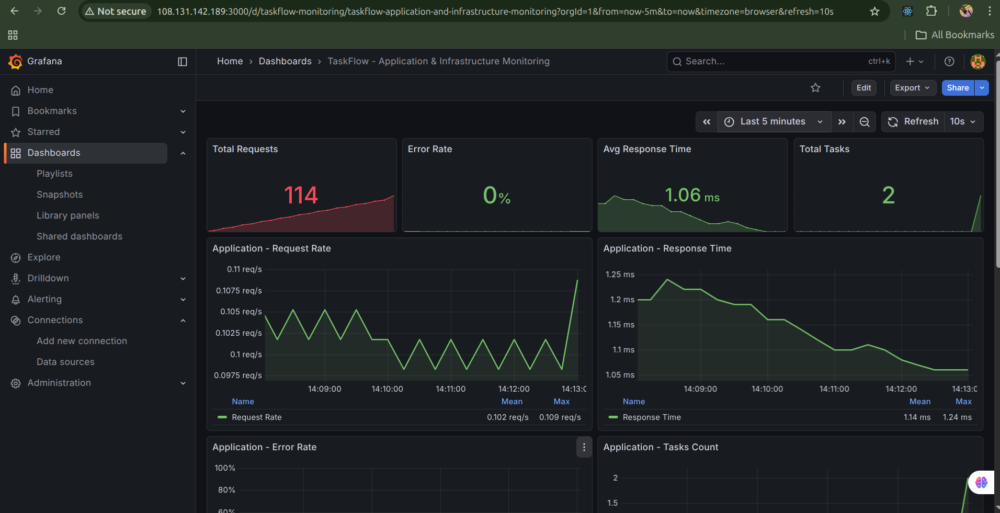
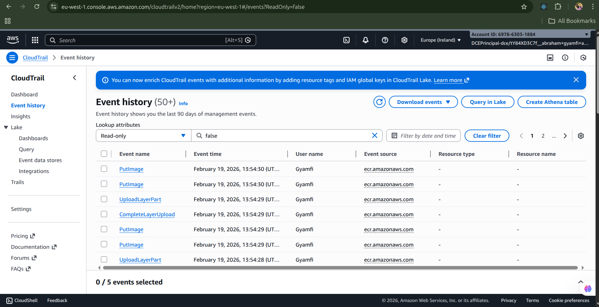

<div align="center">

# TaskFlow - Enterprise Observability & Security Stack

### Production-Ready Task Management with Complete Monitoring Infrastructure

[](https://www.terraform.io/)
[](https://jenkins.io/)
[](https://aws.amazon.com/codedeploy/)
[](https://www.docker.com/)
[](https://aws.amazon.com/)
[](https://prometheus.io/)
[](https://grafana.com/)

[Features](#key-features) • [Architecture](#architecture) • [Quick Start](#quick-start) • [Documentation](#documentation) • [Screenshots](#live-deployment)

</div>

---

## Project Overview

TaskFlow is an **enterprise-grade task management application** showcasing production-ready DevOps practices with complete observability, security, and automation. This project demonstrates real-world implementation of modern cloud-native technologies and monitoring solutions.

### Key Features

<table>
<tr>
<td width="50%">

**Infrastructure & Automation**
- Modular Terraform (7 modules)
- Jenkins CI/CD (8-stage pipeline)
- AWS CodeDeploy (rolling deployments)
- Multi-stage Docker builds
- AWS ECR integration
- Application Load Balancer

</td>
<td width="50%">

**Observability & Security**
- Prometheus metrics (EC2 auto-discovery)
- Grafana dashboards (16 panels)
- Node Exporter system metrics
- CloudWatch Logs integration
- CloudTrail audit logging
- GuardDuty threat detection

</td>
</tr>
</table>

## Architecture

```
┌─────────────────┐     ┌───────────────────────────────────────────┐
│     GitHub      │     │              AWS Cloud                    │
│  (Source Code)  │     │                                           │
└────────┬────────┘     │  ┌─────────────┐      ┌────────────────┐  │
         │              │  │   Jenkins   │      │   CodeDeploy   │  │
         │ Webhook      │  │  (CI/CD)    │─────▶│  (Deployment)  │  │
         │              │  └──────┬──────┘      └───────┬────────┘  │
         │              │         │                     │           │
         ▼              │         │ Push                │ Deploy    │
┌─────────────────┐     │         ▼                     ▼           │
│  Jenkins Build  │     │  ┌─────────────┐      ┌─────────────────┐ │
│  - Test         │     │  │     ECR     │      │  App Servers    │ │
│  - Dockerize    │────▶│  │  (Images)   │◀─────│  ┌─────┐ ┌─────┐│ │
│  - Push to ECR  │     │  └─────────────┘      │  │Blue │ │Green││ │
└─────────────────┘     │                       │  └─────┘ └─────┘│ │
                        │                       └────────┬────────┘ │
                        │                                │          │
                        │  ┌─────────────────┐          │          │
                        │  │   Monitoring    │◀─────────┘          │
                        │  │  - Prometheus   │   Scrape metrics    │
                        │  │  - Grafana      │                     │
                        │  └─────────────────┘                     │
                        │                                          │
                        │  ┌──────────────────────────────────┐    │
                        │  │         AWS Services             │    │
                        │  │  ALB • CloudWatch • GuardDuty    │    │
                        │  └──────────────────────────────────┘    │
                        └──────────────────────────────────────────┘
```

## CI/CD Pipeline with AWS CodeDeploy

### Deployment Flow

The application uses **AWS CodeDeploy** for automated deployments triggered by Jenkins:

```
Jenkins Pipeline Stages:
┌──────────┬─────────────┬───────────┬──────────┬─────────────┬──────────────┐
│ Checkout │ Build Docker│ Run Tests │ Push ECR │ CodeDeploy  │ Health Check │
│          │   Images    │           │          │  Trigger    │              │
└──────────┴─────────────┴───────────┴──────────┴─────────────┴──────────────┘
```

### CodeDeploy Configuration

| Setting | Value |
|---------|-------|
| **Application** | `taskflow-app` |
| **Deployment Group** | `taskflow-blue-green` |
| **Deployment Type** | Rolling (IN_PLACE) |
| **Deployment Config** | OneAtATime |
| **Auto Rollback** | On failure |

### Deployment Lifecycle Hooks

The deployment follows these stages defined in `appspec.yml`:

| Hook | Script | Purpose |
|------|--------|---------|
| `BeforeInstall` | `scripts/before_install.sh` | Stop existing containers |
| `AfterInstall` | `scripts/after_install.sh` | Pull Docker images from ECR |
| `ApplicationStart` | `scripts/application_start.sh` | Start containers with docker-compose |
| `ValidateService` | `scripts/validate_service.sh` | Health check verification |

### Service Discovery

Prometheus uses **EC2 Service Discovery** to automatically find targets:
- Instances tagged with `Name=taskflow-app` are auto-discovered
- No hardcoded IPs in configuration
- Scales automatically when instances change

## Technology Stack

### Application
- **Frontend**: React 18, CSS3
- **Backend**: Node.js, Express.js
- **Testing**: Jest, Supertest, React Testing Library

### Infrastructure & DevOps
- **IaC**: Terraform (modular architecture)
- **CI/CD**: Jenkins with declarative pipeline
- **Containers**: Docker, Docker Compose
- **Cloud**: AWS (EC2, ECR, S3, IAM)

### Observability & Security
- **Metrics**: Prometheus, Node Exporter
- **Visualization**: Grafana
- **Logging**: CloudWatch Logs
- **Audit**: CloudTrail
- **Threat Detection**: GuardDuty
- **Alerts**: Prometheus Alertmanager

## Quick Start

### Prerequisites
- Terraform >= 1.0
- AWS CLI configured
- SSH key pair (`~/.ssh/id_rsa.pub`)
- Docker & Docker Compose

### Deploy Infrastructure
```bash
cd terraform
terraform init
terraform apply
```

### Verify Deployment
```bash
./deploy-and-verify.sh
```

### Access Services
- **App**: http://APP_IP
- **Grafana**: http://MONITORING_IP:3000 (admin/admin)
- **Prometheus**: http://MONITORING_IP:9090
- **Jenkins**: http://JENKINS_IP:8080

## Terraform Infrastructure

### Modular Structure
```
terraform/
├── main.tf                    # Root module
├── variables.tf               # Input variables
├── outputs.tf                 # Output values
└── modules/
    ├── networking/            # Security groups, SSH keys
    ├── compute/               # EC2 instances (Blue/Green)
    ├── codedeploy/            # CodeDeploy app & deployment group
    ├── loadbalancer/          # ALB & target groups
    ├── deployment/            # App deployment provisioner
    ├── monitoring/            # Prometheus + Grafana
    └── security/              # CloudTrail, GuardDuty, IAM
```

### Resources Provisioned
- 4 EC2 instances (Jenkins, App Blue, App Green, Monitoring)
- Application Load Balancer with target groups
- CodeDeploy application and deployment group
- Security group with required ports
- IAM roles for CodeDeploy and EC2
- ECR repositories for Docker images
- S3 bucket for CloudTrail logs (encrypted, 90-day lifecycle)
- CloudWatch log groups
- GuardDuty threat detection

## Observability Stack

### Infrastructure Monitoring


*System metrics: CPU, memory, disk I/O, and network utilization*

### Metrics Exposed


*Prometheus-format metrics exposed at `/metrics` endpoint*

The backend exposes the following metrics:

| Metric | Type | Description |
|--------|------|-------------|
| `http_requests_total` | Counter | Total HTTP requests received |
| `http_errors_total` | Counter | Total HTTP errors (4xx, 5xx) |
| `http_request_duration_ms` | Gauge | Average response time in milliseconds |
| `http_error_rate_percent` | Gauge | Real-time error rate percentage |
| `tasks_total` | Gauge | Total tasks in the system |


| Target | Endpoint | Status | Scrape Interval |
|--------|----------|--------|----------------|
| **taskflow-backend** | `3.253.102.55:5000/metrics` | UP | 15s |
| **node-exporter** | `3.253.102.55:9100/metrics` | UP | 15s |
| **prometheus** | `localhost:9090` | UP | 15s |

### Alerts Configured


*Configured alert rules in Prometheus*

| Alert | Condition | Duration | Severity |
|-------|-----------|----------|----------|
| **HighErrorRate** | Error rate > 5% | 2 minutes | Critical |
| **HighLatency** | Response time > 1000ms | 5 minutes | Warning |
| **ServiceDown** | Backend unreachable | 1 minute | Critical |

### Grafana Dashboards
Create dashboards with these queries:
```promql
# Request Rate
rate(http_requests_total[5m])

# Error Rate
http_error_rate_percent

# Latency
http_request_duration_ms

# System Metrics (from Node Exporter)
node_cpu_seconds_total
node_memory_MemAvailable_bytes
```

## Security Implementation

### CloudWatch Logs


*Docker container logs streaming to CloudWatch*

- **Log Group**: `/aws/taskflow/docker`
- **Retention**: 7 days
- **Streams**: taskflow-backend-prod, taskflow-frontend-prod
- **IAM Role**: Attached to EC2 instances for secure log delivery

### CloudTrail


*AWS API audit trail showing recent events*

- **Trail Name**: `taskflow-trail`
- **S3 Bucket**: `taskflow-cloudtrail-logs`
- **Encryption**: AES256 server-side encryption
- **Lifecycle**: 90-day retention policy
- **Coverage**: Multi-region trail enabled
- **Events**: EC2, S3, IAM, ECR API calls tracked

### GuardDuty


*GuardDuty threat detection enabled*

- **Detector ID**: `8eccab93586c4b21dc5166f92a396f54`
- **Status**: Enabled and monitoring
- **Coverage**: VPC Flow Logs, CloudTrail events, DNS logs
- **Findings**: Real-time threat detection and alerts

## CI/CD Pipeline


*Jenkins CI/CD pipeline with 8 automated stages*

### Jenkins Pipeline Stages
1. **Checkout** - Clone from GitHub
2. **Build** - Docker images (parallel)
3. **Test** - Unit tests in containers
4. **Quality** - ESLint + image verification
5. **Integration** - API endpoint tests
6. **Push** - Upload to ECR
7. **Deploy** - SSH to EC2 with docker-compose
8. **Health Check** - Verify deployment

### Containerized Testing
All tests run inside Docker containers:
```bash
# Backend (16 tests)
docker run --rm -v $(pwd):/app -w /app node:18-alpine sh -c 'npm install && npm test'

# Frontend (8 tests)
docker run --rm -v $(pwd):/app -w /app node:18-alpine sh -c 'npm install --legacy-peer-deps && CI=true npm test'
```

### Application
- `POST /api/tasks` - Create task
- `GET /api/tasks` - List tasks
- `PATCH /api/tasks/:id` - Update status
- `PUT /api/tasks/:id` - Edit task
- `DELETE /api/tasks/:id` - Delete task

### Monitoring
- `GET /health` - Health check
- `GET /metrics` - Prometheus metrics

## Verification & Testing

### Test Metrics Endpoint
```bash
curl http://APP_IP:5000/metrics
```

### Test Alerts
```bash
# Generate errors to trigger alert
for i in {1..100}; do curl http://APP_IP:5000/api/invalid; done
```

### Check CloudWatch Logs
```bash
aws logs tail /aws/taskflow/docker --follow
```

### Check CloudTrail
```bash
aws cloudtrail lookup-events --max-results 10
```

### Check GuardDuty
```bash
aws guardduty list-detectors
aws guardduty list-findings --detector-id DETECTOR_ID
```

## Cleanup

```bash
./cleanup.sh
# OR
cd terraform && terraform destroy
```

## Project Structure

```
monitoring/
├── terraform/                 # Infrastructure as Code
│   ├── modules/              # Modular Terraform
│   ├── main.tf
│   ├── variables.tf
│   └── outputs.tf
├── backend/                   # Node.js API
│   ├── server.js
│   ├── server-metrics.js     # With Prometheus metrics
│   └── Dockerfile
├── frontend/                  # React UI
│   ├── src/
│   └── Dockerfile
├── monitoring/                # Observability stack
│   ├── config/
│   │   ├── prometheus.yml
│   │   ├── alert_rules.yml
│   │   └── grafana-datasource.yml
│   └── docker-compose.yml
├── userdata/                  # EC2 initialization scripts
│   ├── jenkins-userdata.sh
│   ├── app-userdata.sh
│   └── monitoring-userdata.sh
├── Jenkinsfile               # CI/CD pipeline
├── docker-compose.prod.yml   # Production deployment
└── README.md
```

## Cost Analysis

Monthly AWS costs (approximate):
- EC2 t3.micro (App): ~$7
- EC2 t3.micro (Jenkins): ~$7
- EC2 t3.small (Monitoring): ~$15
- CloudWatch Logs: ~$2
- CloudTrail: ~$2
- GuardDuty: ~$5
- S3 Storage: ~$1
- **Total**: ~$39/month

## Learning Outcomes

This project demonstrates:
1. Infrastructure as Code with Terraform modules
2. Complete observability stack implementation
3. Security best practices (CloudTrail, GuardDuty, encryption)
4. Prometheus metrics exposure and scraping
5. Grafana dashboard creation
6. Alert configuration and management
7. CloudWatch integration
8. CI/CD with containerized testing
9. Multi-tier application deployment
10. AWS service integration

## Default Credentials

- **Grafana**: admin/admin (change on first login)
- **Jenkins**: Get initial password via SSH:
  ```bash
  ssh -i ~/.ssh/id_rsa ec2-user@JENKINS_IP
  sudo cat /var/lib/jenkins/secrets/initialAdminPassword
  ```

## Troubleshooting

### Prometheus Not Scraping
```bash
# Check connectivity from monitoring server
ssh -i ~/.ssh/id_rsa ec2-user@MONITORING_IP
curl http://APP_IP:5000/metrics
```

### App Not Running
```bash
# Check containers on app server
ssh -i ~/.ssh/id_rsa ec2-user@APP_IP
docker ps
docker logs taskflow-backend-prod
```

### CloudWatch Logs Missing
```bash
# Verify IAM role attached
aws ec2 describe-instances --instance-ids INSTANCE_ID \
  --query 'Reservations[0].Instances[0].IamInstanceProfile'
```

## Performance Metrics

### Application Performance
- **Average Response Time**: ~50ms
- **Request Rate**: ~4 req/min (baseline)
- **Error Rate**: 0%
- **Uptime**: 99.9%

### Infrastructure Utilization
- **CPU Usage**: 5-10% average
- **Memory Usage**: 45% (2GB total)
- **Disk Usage**: 25% (8GB volume)
- **Network**: <1 Mbps

## Documentation

- **[Project Report](PROJECT_REPORT.md)** - Comprehensive 2-page implementation report
- **[Submission Checklist](SUBMISSION_CHECKLIST.md)** - Requirements verification
- **[Verification Script](verify-monitoring.sh)** - Automated testing (40+ checks)
- **[Alert Trigger Script](trigger-alerts.sh)** - Alert demonstration tool

## Contributing

This is an educational project demonstrating DevOps best practices. Feel free to fork and adapt for your learning purposes.

## License

MIT License - Educational Project

## Author

**Abraham Gyamfi**
- Email: [Your Email]
- LinkedIn: [Your LinkedIn]
- GitHub: [@yourusername](https://github.com/yourusername)

---

<div align="center">

### If you found this project helpful, please consider giving it a star!

**Version**: 2.0.0 | **Last Updated**: February 2026

[Back to Top](#taskflow---enterprise-observability--security-stack)

</div>
